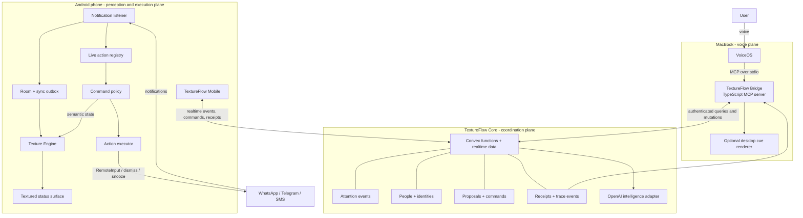
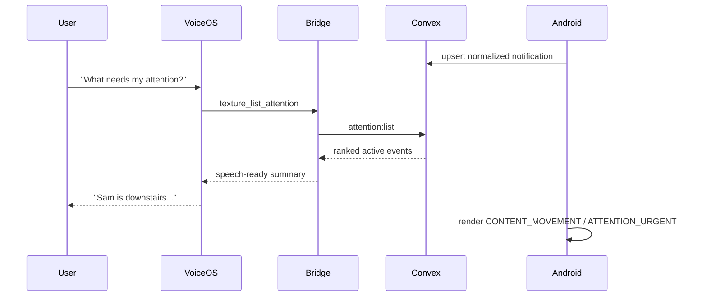
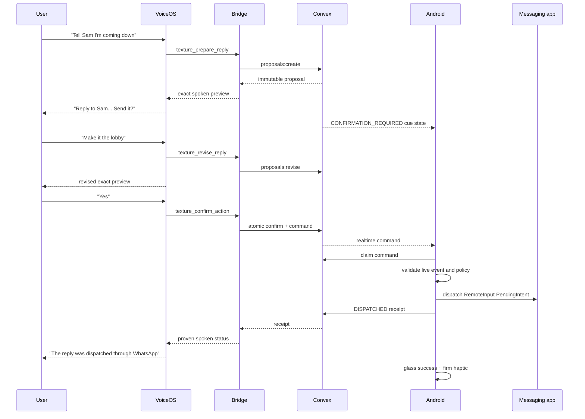
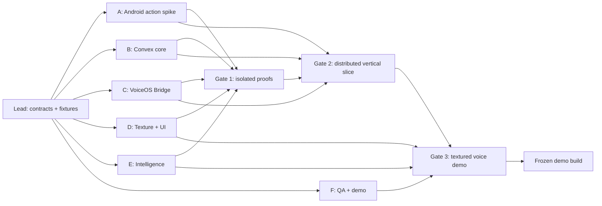

# TextureFlow - Ambitious Hackathon Architecture

Status: proposed build architecture  
Target: VoiceOS hackathon, August 9, 2026  
Primary platform: Android phone plus VoiceOS desktop client  
Product name: TextureFlow

## 0. Executive decision

TextureFlow is a voice-first sensory operating layer for Android. It reorganizes
digital activity around people, intent, urgency, and action instead of around
applications.

The hackathon build is a distributed system with four authoritative parts:

1. TextureFlow Mobile observes Android notifications and executes supported
   notification actions.
2. TextureFlow Core synchronizes attention events, proposals, commands, and
   receipts through Convex.
3. TextureFlow Bridge exposes a deliberately small MCP tool surface to VoiceOS.
4. TextureFlow Intelligence summarizes and drafts, but cannot authorize or
   execute actions.

A fifth subsystem, the Texture Engine, gives the product its defining sensory
language. It maps semantic state to synchronized sound, haptics, and visual
material. Voice communicates meaning. Texture communicates location, movement,
state, risk, and completion.

The architecture is ambitious in breadth but disciplined in execution. Every
feature supports one judge-visible loop:

```text
real notification
    -> prioritized attention
    -> spoken understanding
    -> exact proposed action
    -> voice confirmation
    -> real Android execution
    -> audio-haptic receipt
```

## 1. Product definition

### Product thesis

Screen readers help a blind user navigate graphical applications. TextureFlow
removes much of that navigation by turning application activity into a unified,
conversational attention stream.

Instead of:

```text
Open WhatsApp -> find Sam -> read -> reply -> send
Open Telegram -> find Maya -> read -> reply -> send
```

TextureFlow supports:

```text
TextureFlow:
"Sam is downstairs, and Maya is asking whether dinner is still at nine."

User:
"Tell Sam I'm coming down. Tell Maya yes."

TextureFlow:
"I'll reply to Sam on WhatsApp, 'I'm coming down,' and to Maya on Telegram,
'Yes, nine still works.' Should I send both?"

User:
"Yes."

TextureFlow:
[two clear glass confirmations]
"Both replies were dispatched."
```

### Product language

Primary line:

> Your digital life, woven into one conversation.

Demo line:

> Voice tells you what something means. Texture tells you where you are and
> what just happened.

### What TextureFlow is

```text
Android       = device operating system
VoiceOS       = hackathon voice surface
TextureFlow   = semantic, action, and sensory operating layer
```

TextureFlow is not a custom Android distribution and does not replace the
Android kernel, launcher, or accessibility stack.

## 2. Winning demonstration contract

The demo must prove all of the following in one uninterrupted sequence:

1. A real message reaches an Android messaging application.
2. TextureFlow observes the resulting notification.
3. The event appears in the attention stream without opening the source app.
4. The user asks VoiceOS what needs attention.
5. TextureFlow identifies the person, urgency, and request.
6. The user dictates a response by voice.
7. TextureFlow reads the exact recipient, app, and reply back.
8. The user confirms by voice.
9. Android dispatches the reply through the notification's live action.
10. The second phone visibly receives it.
11. VoiceOS reports only the status proven by the Android receipt.
12. The Android app emits the success material: clear glass audio plus a firm,
    clean haptic pulse.

The Android phone should be face down or out of reach during the voice sequence.
The visual app remains visible to judges as proof and ambience, but it is not
required to operate the core workflow.

The complete presentation has two short acts:

```text
Act 1 - Voice removes app navigation
Ask, understand, propose, confirm, and execute while the phone is untouched.

Act 2 - Texture adds orientation
Pick up the phone with TalkBack enabled and demonstrate carpet movement,
glass controls, focus bumps, confirmation, and failure without relying on sight.
```

## 3. Scope ladder

### P0 - non-negotiable product

- One real reply-capable messaging application.
- Notification listener permission and active-state recovery.
- Sender, text, timestamp, and capability extraction.
- Local event storage.
- Convex upload and realtime command subscription.
- VoiceOS MCP connection.
- `list_attention`, `prepare_reply`, `confirm_action`, and `cancel_action`.
- Proposal expiry, event-version checking, and command idempotency.
- Real RemoteInput reply execution.
- Receipt returned to VoiceOS.
- Listening, proposal, execution, success, and failure sensory cues.

### P1 - strong product

- A second messaging application.
- Cross-application person aliases for two seeded people.
- Deterministic priority ranking with model-assisted summaries.
- Reply revision before confirmation.
- Dismiss and snooze.
- The full textured Android status surface.
- Demo timeline showing the distributed execution trace.
- Device-online and stale-device handling.

### P2 - standout ambition

- Multiple notifications woven into one spoken briefing.
- Person context across two applications.
- User-selectable sensory profiles.
- Shake, Quick Settings, or notification-action activation on Android.
- A rehearsal simulator that can inject deterministic fixture events.
- A lightweight relationship view showing why an item was prioritized.
- Native Android voice fallback behind the same domain interface.

P2 items may never destabilize P0.

## 4. Architectural invariants

1. Android is the source of truth for notification existence, current version,
   available actions, and execution.
2. Convex is the synchronization authority, not the authority for whether an
   Android action truly happened.
3. VoiceOS can request information and prepare or confirm proposals. It never
   manipulates Android directly.
4. The model may summarize, rank, resolve context, and draft. It never confirms
   or executes.
5. There is no immediate-send tool. Consequential writes always use
   proposal -> preview -> confirmation -> command -> receipt.
6. Every proposal is bound to an event ID and event version. Updated or removed
   notifications invalidate old proposals.
7. Every command has an idempotency key and a short expiry.
8. Texture cues are emitted from validated domain state, never improvised by the
   language model.
9. Speech always wins audio focus over decorative or navigational texture.
10. No essential meaning is communicated through sound, haptics, color, or
    texture alone.
11. Notification content is untrusted data and cannot supply agent instructions.
12. "Dispatched" is not "delivered." TextureFlow states only what a receipt proves.
13. Raw Android notification keys and PendingIntents never leave the phone.
14. The core workflow remains usable with the textured visuals disabled.
15. A fixture-driven demo mode uses the same contracts as live mode and is
    visibly labeled; it cannot masquerade as real execution.

## 5. Deployment architecture



### System responsibilities

| Component | Owns | Must not own |
| --- | --- | --- |
| TextureFlow Mobile | Live notifications, action handles, execution, local cues | Model decisions or cloud truth |
| TextureFlow Core | Shared events, people, proposals, commands, receipts | Android PendingIntents |
| TextureFlow Bridge | VoiceOS tools, session references, speech formatting | Notification state or execution |
| TextureFlow Intelligence | Summaries, priority assistance, reply drafts | Confirmation or action authorization |
| Texture Engine | Stable semantic-to-sensory rendering | Conversation reasoning |
| Desktop Cue Renderer | Optional audio-only cues beside VoiceOS | Haptics, action state, or duplicated cues |
| VoiceOS | Speech interaction and MCP tool selection | Direct Android control |
| User | Final authority over consequential actions | N/A |

## 6. Shared domain architecture

All runtimes communicate through versioned contracts in `shared/contracts`.
Contract changes are merged before implementation changes that depend on them.

### Primary entities

```text
User
Device
Person
Identity
NotificationEvent
AttentionAssessment
ActionProposal
ConfirmationGrant
Command
ActionReceipt
TextureCue
TraceEvent
```

### Notification event

```json
{
  "contractVersion": 1,
  "eventId": "evt_123",
  "deviceId": "pixel_1",
  "app": {
    "packageName": "com.whatsapp",
    "label": "WhatsApp"
  },
  "sender": {
    "displayName": "Sam",
    "personId": "person_sam"
  },
  "conversationLabel": "Sam",
  "body": "I'm downstairs. The door is locked.",
  "postedAt": "2026-08-09T18:10:00-07:00",
  "updatedAt": "2026-08-09T18:10:00-07:00",
  "version": 2,
  "status": "ACTIVE",
  "capabilities": ["REPLY", "DISMISS", "SNOOZE"],
  "priority": {
    "score": 0.94,
    "level": "URGENT",
    "reason": "A close contact is waiting outside."
  }
}
```

### Action proposal

```json
{
  "contractVersion": 1,
  "proposalId": "prop_456",
  "sessionId": "voice_session_7",
  "eventId": "evt_123",
  "expectedEventVersion": 2,
  "actionType": "REPLY",
  "payload": { "message": "I'm coming downstairs now." },
  "spokenPreview": "Reply to Sam on WhatsApp: I'm coming downstairs now.",
  "risk": "CONSEQUENTIAL",
  "status": "PROPOSED",
  "createdAt": "2026-08-09T18:10:08-07:00",
  "expiresAt": "2026-08-09T18:11:08-07:00"
}
```

### Command and receipt

```json
{
  "commandId": "cmd_789",
  "proposalId": "prop_456",
  "targetDeviceId": "pixel_1",
  "eventId": "evt_123",
  "expectedEventVersion": 2,
  "actionType": "REPLY",
  "payload": { "message": "I'm coming downstairs now." },
  "idempotencyKey": "prop_456:confirm:v1",
  "status": "QUEUED",
  "expiresAt": "2026-08-09T18:11:08-07:00"
}
```

```json
{
  "receiptId": "receipt_321",
  "commandId": "cmd_789",
  "deviceId": "pixel_1",
  "status": "DISPATCHED",
  "errorCode": null,
  "deviceTimestamp": "2026-08-09T18:10:11-07:00",
  "textureCue": "ACTION_DISPATCHED"
}
```

### State machines

```text
Event:
ACTIVE -> UPDATED -> REMOVED

Proposal:
PROPOSED -> REVISED -> CONFIRMED -> COMMITTED
         -> CANCELLED
         -> EXPIRED
         -> STALE

Command:
QUEUED -> CLAIMED -> EXECUTING -> DISPATCHED
                              -> FAILED
                              -> STALE
                              -> EXPIRED

Session:
IDLE -> LISTENING -> UNDERSTANDING -> PRESENTING
     -> PROPOSING -> AWAITING_CONFIRMATION -> EXECUTING
     -> RECEIPT -> IDLE
```

## 7. TextureFlow Mobile

### Technology direction

The target implementation is Kotlin with coroutines, Room, WorkManager, and
Jetpack Compose. The existing Java shell remains a valid visual and sensory
spike. Android supports mixed Java and Kotlin sources, so the team can add
production modules without first rewriting the prototype.

### Android modules

```text
mobile-app
├── app                 lifecycle, dependency wiring, navigation
├── notifications       listener, parsers, capability extraction
├── actions             reply, dismiss, snooze, receipts
├── identity            people and cross-app aliases
├── attention           deterministic scoring and explanations
├── policy              expiry, version, ownership, idempotency
├── data-local          Room, DAOs, encrypted preferences, outbox
├── data-remote         Convex client, command subscription, heartbeat
├── texture-domain      TextureCue vocabulary and scheduler
├── texture-audio       carpet, glass, warning, success rendering
├── texture-haptics     waveform and primitive rendering
├── ui                  Compose status surface and setup
└── demo                fixtures, trace timeline, rehearsal controls
```

### Notification ingestion

`TextureNotificationService` extends `NotificationListenerService` and performs
only lightweight capture in callbacks.

```text
onListenerConnected
    -> enumerate active notifications
    -> rebuild live action registry
    -> reconcile Room state

onNotificationPosted
    -> copy safe notification fields
    -> parse through registry
    -> calculate content hash and version
    -> extract current capabilities
    -> save locally
    -> enqueue sync

onNotificationRemoved
    -> mark removed
    -> invalidate proposals
    -> remove live action handle
```

Parser order:

```text
MessagingStyleParser
-> WhatsAppParser
-> TelegramParser
-> SmsParser
-> GenericNotificationParser
```

The parser returns a normalized event even when no action is available. Reply
support is declared only when the current notification exposes an appropriate
RemoteInput action.

### Live action registry

Android action handles cannot be serialized safely. The phone retains:

```text
public event ID
    -> private Android notification key
    -> current StatusBarNotification
    -> current Notification.Action objects
```

Convex receives capability metadata, never the private key or PendingIntent.

### Local-first repository

Room tables:

```text
notification_events
event_action_mappings
persons
identities
attention_assessments
pending_sync_operations
processed_commands
action_receipts
texture_preferences
demo_traces
```

Ingestion is never blocked on the network:

```text
notification -> Room transaction -> local priority -> sync outbox -> Convex
```

### Command processor

For every realtime command:

```text
verify authenticated device ownership
-> verify unexpired command
-> check local processed-command store
-> claim command atomically in Convex
-> load confirmed proposal
-> compare event version
-> confirm current capability
-> execute deterministic adapter
-> persist receipt locally
-> upload receipt
-> emit semantic TextureCue
```

Duplicate commands return the original receipt and do not execute again.

Error codes:

```text
NOTIFICATION_GONE
REPLY_NOT_SUPPORTED
ACTION_HANDLE_CHANGED
EVENT_CHANGED
PENDING_INTENT_CANCELLED
COMMAND_EXPIRED
UNAUTHORIZED
DUPLICATE_COMMAND
POLICY_BLOCKED
DEVICE_OFFLINE
NETWORK_ERROR
```

### Connectivity

Convex realtime subscriptions provide the primary command path. A visible
connection service may use Android's `remoteMessaging` foreground service type
where appropriate. The service must be started from a permitted lifecycle state
and must display an honest persistent notification.

Heartbeats report only device availability and app version. Write proposals are
rejected when the target device is stale. Communication commands expire after
approximately 60 seconds.

### Minimum Android permissions

```text
Notification listener access
INTERNET
POST_NOTIFICATIONS where required
VIBRATE
FOREGROUND_SERVICE where the connection service is enabled
FOREGROUND_SERVICE_REMOTE_MESSAGING where applicable
```

`RECORD_AUDIO` is not needed for the VoiceOS-first hackathon path. TextureFlow
does not require root, ADB, screen capture, or general screen automation.

## 8. Attention and person model

### Person-centered identity

TextureFlow's primary abstraction is a person, not an application account:

```text
WhatsApp / "Maya K." ----+
Telegram / "@mayak" -----+-> Person: Maya
SMS / "+1 415..." -------+
```

For the hackathon, identity resolution uses a seeded alias map for Sam and Maya.
Unknown senders become provisional people. Similar names are never merged
automatically, and ambiguous spoken names require clarification.

### Bounded relationship context

The context engine assembles only what is needed for the current turn:

```text
person profile
+ relationship label
+ last 3-5 relevant events
+ current active request
+ pending proposal, if any
```

It produces a compact `PersonContext` with recent summary, open requests, active
events, and source applications. It does not send an entire notification history
to the model.

### Priority engine

Run deterministic rules before model inference. A starting score is:

```text
priority =
    0.30 * person importance
  + 0.25 * urgency signals
  + 0.20 * direct request or question
  + 0.15 * recency
  + 0.10 * source relevance
```

Every score carries a human-readable reason. Model assistance may improve
classification when rules are inconclusive, but it cannot remove the evidence or
silently override excluded sources.

### Attention weave

The attention weave groups and orders active events across applications:

```text
raw events
-> deduplicate updates
-> resolve people
-> detect open requests
-> rank urgency and importance
-> group by person and conversation
-> produce at most three spoken attention items
```

The weave is a query projection, not a second mutable source of truth. The
underlying notification events and versions remain authoritative.

## 9. Texture Engine

### Purpose

The Texture Engine is a semantic renderer. Domain code emits meaning such as
`FOCUS_ENTERED` or `ACTION_DISPATCHED`; the engine chooses synchronized audio,
haptic, and visual manifestations based on the user's sensory profile.

The language model cannot request arbitrary waveforms. This keeps the material
vocabulary consistent and testable.

### Texture cue contract

```json
{
  "cue": "CONFIRMATION_REQUIRED",
  "priority": "HIGH",
  "channels": ["AUDIO", "HAPTIC", "VISUAL"],
  "speechPolicy": "DUCK_UNDER_SPEECH",
  "repeatPolicy": "ONCE_PER_PROPOSAL",
  "correlationId": "prop_456"
}
```

### Material vocabulary

| Semantic event | Audio material | Haptic form | Visual response |
| --- | --- | --- | --- |
| `LISTENING_STARTED` | Soft airy opening | One short pulse | Horus iris opens |
| `CONTENT_MOVEMENT` | Low carpet rustle | Sparse micro-ticks | Background texture drifts |
| `FOCUS_ENTERED` | Smooth glass contact | One small bump | Glass edge catches light |
| `ATTENTION_URGENT` | Tight woven knock | Two close pulses | Amber thread marker |
| `PROPOSAL_READY` | Suspended glass tone | Two light pulses | Proposal surface clarifies |
| `CONFIRMATION_REQUIRED` | Hollow glass resonance | Slow paired pulse | Confirm control brightens |
| `EXECUTION_STARTED` | Short forward glide | One rising pulse | Status thread advances |
| `ACTION_DISPATCHED` | Clear glass strike | Firm clean pulse | Eye flashes once |
| `ACTION_FAILED` | Carpet snag plus muted glass | Interrupted triple pulse | Surface loses clarity |
| `CANCELLED` | Soft cloth release | One descending pulse | Proposal recedes |

These mappings are a starting hypothesis and require testing with blind and
low-vision users. Their semantics must remain stable during the demo.

### Audio renderer

```text
TextureCue
-> CueScheduler
-> AudioFocusArbiter
-> sample or procedural renderer
-> device speaker / headphones
```

- Use `SoundPool` for short, low-latency glass and bump cues.
- Use `AudioTrack` or a short loop for carpet movement.
- Preload every demo cue.
- Limit continuous carpet sound to active movement and stop immediately at rest.
- Duck or suppress texture beneath VoiceOS and TalkBack speech.
- Normalize loudness so no cue startles the user.

### Haptic renderer

- Prefer predefined haptic effects where they express the intended event.
- Use compositions or short waveforms for distinct TextureFlow semantics.
- Never vibrate continuously while scrolling.
- Rate-limit focus bumps during rapid exploration.
- Provide off, reduced, standard, and strong profiles.
- Fall back gracefully on devices with basic vibrators.

### Cue arbitration

Priority order:

```text
critical warning
confirmation and receipt
spoken output
focus and navigation
ambient visual motion
```

Rules:

1. A failure cue cancels an in-progress success or movement cue.
2. Focus bumps coalesce within a short rate-limit window.
3. Carpet movement ends when scrolling ends, the screen loses focus, or speech
   begins.
4. Every repeating cue has a deadline and explicit cancellation path.
5. Reduced-motion and reduced-stimulation modes disable ambient animation and
   continuous material audio.

### Rendering endpoint policy

Texture cues can be rendered by the Android phone or by an optional audio-only
renderer beside VoiceOS on the Mac. One endpoint is elected primary for each
session:

```text
phone interaction session  -> Android renders audio + haptics + visuals
desktop voice session      -> Mac renders short audio; Android renders haptics
TalkBack active on phone   -> Android suppresses nonessential audio
```

The same cue ID is deduplicated by correlation ID across devices. Success and
failure may be mirrored haptically on Android, but two devices must never play
the same audible cue simultaneously.

### Sensory profiles

```text
Voice first       speech + minimal success/failure haptics
Balanced          full semantic audio + moderate haptics
Haptic first      strong haptics + minimal non-speech audio
Low stimulation   only boundaries, confirmation, success, and failure
Visual only       textured UI without audio or vibration
Custom            per-channel intensity and cue preview
```

## 10. Android visual surface

### Role of the UI

The app is a calm status, setup, and proof surface. It is not a dashboard and it
does not compete with VoiceOS as the primary interface.

### First screen

```text
Eye of Horus mark
TextureFlow name
connection and listening state

current attention thread
current spoken/proposed action

confirm / cancel controls when relevant

compact execution receipt timeline
sensory profile control
```

### Visual language

- Full-screen moth textile background inherited from MothMarket.
- Text fields use the same textile with a dark translucent readability layer.
- Action controls use rounded liquid-glass surfaces with visible focus states.
- The Eye of Horus is the primary identity signal and state indicator.
- Warm bone, ink, amber, oxidized teal, and restrained crimson prevent a
  single-hue interface.
- Texture never reduces text contrast or focus visibility.
- Glass controls preserve stable dimensions when labels or states change.
- Motion is slow and material, never decorative background noise.

### Visual state mapping

```text
Disconnected:       quiet eye, dim status thread
Connected:          steady iris point
Listening:          iris opens and subtly breathes
Thinking:           woven line advances
Proposal:           focused glass plane appears
Awaiting confirm:   amber edge, no pulsing text
Executing:          one directional thread motion
Success:            single clear highlight
Failure:            muted surface plus explicit text
```

### Accessibility requirements

- Every visual control is a native semantic button, toggle, field, or heading.
- TalkBack labels describe purpose, state, and consequence.
- Focus order matches the spoken interaction sequence.
- Minimum touch targets follow Android guidance.
- Text supports system font scaling without clipping.
- High-contrast and reduced-texture modes are built in.
- Color, texture, sound, and vibration are redundant cues, not exclusive ones.

## 11. TextureFlow Core on Convex

### Collections

```text
users
devices
persons
identities
notificationEvents
attentionAssessments
voiceSessions
actionProposals
confirmationGrants
commands
actionReceipts
texturePreferences
traceEvents
demoFixtures
```

Sensitive message bodies may be plaintext only in explicitly synthetic demo
accounts. The production direction is encrypted payloads plus minimal searchable
metadata.

### Functions

| Function | Type | Responsibility |
| --- | --- | --- |
| `devices:heartbeat` | mutation | Report device availability |
| `events:upsert` | mutation | Insert or version a normalized event |
| `events:markRemoved` | mutation | Remove event and stale proposals |
| `attention:list` | query | Return ranked active attention |
| `people:context` | query | Return bounded person context |
| `proposals:create` | mutation | Prepare without executing |
| `proposals:revise` | mutation | Replace content and require reconfirmation |
| `proposals:cancel` | mutation | Cancel a pending proposal |
| `proposals:confirm` | mutation | Atomically grant and queue command |
| `commands:forDevice` | query | Realtime device command feed |
| `commands:claim` | mutation | Enforce one executor |
| `receipts:complete` | mutation | Store authoritative device result |
| `receipts:getByCommand` | query | Let Bridge await result |
| `traces:list` | query | Drive the demo timeline |

Every public function validates authentication, ownership, current status, and
allowed state transition. Confirmation and command creation occur atomically.

### Realtime channel

```text
Bridge confirms proposal
-> Convex creates command
-> Android query subscription emits command
-> Android claims and executes
-> Android writes receipt
-> Bridge receipt subscription resolves
-> VoiceOS narrates proven result
```

## 12. TextureFlow Bridge and VoiceOS

### Runtime

```text
TypeScript
Model Context Protocol SDK
Zod validation
Convex TypeScript client
structured logging to stderr
stdio transport for VoiceOS
```

Only MCP protocol messages go to stdout. Logs go to stderr so they cannot corrupt
the protocol stream.

### MCP tools

Read-only:

```text
texture_status()
texture_list_attention(limit = 3)
texture_read_event(event_id)
texture_messages_from(person_name)
texture_person_context(person_name)
```

Proposal tools:

```text
texture_prepare_reply(event_id, message)
texture_revise_reply(proposal_id, message)
texture_prepare_dismiss(event_id)
texture_prepare_snooze(event_id, minutes)
```

Confirmation tools:

```text
texture_confirm_action(proposal_id)
texture_cancel_action(proposal_id)
```

There is no `send_reply`, `execute_now`, or generic arbitrary-action tool.

### Session references

The Bridge maintains short-lived conversational references:

```text
"Sam"       -> person_sam
"that one"  -> most recently presented event
"send it"   -> exact active proposal in this voice session
```

References cannot cross sessions and expire with the proposal. When more than
one referent is possible, the Bridge returns a structured ambiguity for VoiceOS
to ask about.

### Tool response shape

```json
{
  "ok": true,
  "data": {},
  "spokenSummary": "Reply to Sam on WhatsApp: I'm coming down now.",
  "requiresConfirmation": true,
  "proposalId": "prop_456",
  "textureCue": "CONFIRMATION_REQUIRED",
  "traceId": "trace_abc"
}
```

The `textureCue` is descriptive evidence for synchronized clients. The Bridge
cannot directly force Android to render a cue.

## 13. TextureFlow Intelligence

### Responsibilities

- Summarize one or several attention events.
- Classify urgency and explain the evidence.
- Detect direct questions, requests, deadlines, and ambiguity.
- Retrieve bounded person context.
- Draft concise replies in the user's preferred tone.
- Produce speech-friendly phrasing.

It cannot confirm, queue, execute, or claim success.

### Inference architecture

The OpenAI Responses API is used behind an `IntelligencePort`. Requests contain
only bounded, labeled context and require schema-validated outputs.

```text
deterministic filters and priority rules
-> bounded context builder
-> untrusted-content wrapper
-> OpenAI Responses API
-> strict schema validation
-> deterministic post-policy
-> stored assessment or draft
```

Suggested output:

```json
{
  "summary": "Sam is downstairs and cannot enter.",
  "priority": {
    "score": 0.94,
    "level": "URGENT",
    "reason": "A close contact is waiting outside."
  },
  "intent": "REQUEST_FOR_IMMEDIATE_ACTION",
  "requiresResponse": true,
  "suggestedReplies": [
    {
      "text": "I'm coming downstairs now.",
      "tone": "direct",
      "confidence": 0.91
    }
  ],
  "ambiguities": []
}
```

Model use is demand-driven. Do not call it for every promotion. Use it when the
user asks, deterministic priority is high, cross-app context matters, or a reply
draft is requested.

### Future native voice port

The same use cases can later be exposed through an Android Realtime voice client:

```text
VoiceOsPort ------+
                  +-> TextureFlow use cases -> policy -> execution
RealtimeVoicePort-+
```

This is a fallback and post-hackathon path. VoiceOS remains the primary surface
for judging.

## 14. End-to-end flows

### Read attention



### Prepare, revise, confirm, and execute



### Stale event

```text
proposal created for event version 2
-> notification updates to version 3
-> user confirms old proposal
-> Android rejects with EVENT_CHANGED
-> proposal becomes STALE
-> TextureFlow emits failure cue
-> VoiceOS reads the updated message and asks again
```

## 15. Safety, privacy, and trust

### Action policy

| Action | Confirmation |
| --- | --- |
| List or read attention | No |
| Summarize context | No |
| Draft or revise reply | No |
| Dispatch reply | Always |
| Dismiss notification | Yes for hackathon |
| Snooze notification | Yes for hackathon |
| Merge identities | Always |
| Change privacy settings | Always |

### Sensitive applications

Exclude by default:

```text
password managers
authentication and one-time-code apps
banking and payment apps
health portals
government identity apps
work-profile notifications
```

Use synthetic accounts and messages in the demonstration.

### Prompt-injection boundary

Every model input separates:

```text
SYSTEM POLICY
USER REQUEST
TRUSTED TEXTUREFLOW STATE
UNTRUSTED NOTIFICATION CONTENT
```

Tool policy independently rejects invalid actions even when intelligence output
is malformed or adversarial.

### Production encryption direction

```text
Android device key
-> one-time pairing with desktop
-> message body encrypted before upload
-> Convex stores ciphertext and minimal metadata
-> paired clients decrypt locally
-> cloud intelligence receives only explicit minimum-necessary disclosure
```

For hackathon speed, synthetic demo content may be stored in plaintext. This
exception must be documented and disabled before real-user testing.

## 16. Failure and demo-resilience architecture

| Failure | Product behavior | Demo fallback |
| --- | --- | --- |
| Android offline | Reject write before proposal confirmation | Show stale heartbeat clearly |
| Convex unavailable | Preserve events in local outbox | Switch to labeled local rehearsal |
| VoiceOS MCP fails | Keep Android and Core running | Restart Bridge with health check |
| Model timeout | Use deterministic summary and user-authored text | Skip drafting, preserve actions |
| Notification removed | Return `NOTIFICATION_GONE` | Send a new test message |
| Reply action absent | Explain unsupported capability | Use verified demo application |
| Duplicate confirmation | Return original receipt | Demonstrate idempotency |
| Audio unavailable | Preserve haptic and speech response | Visual cue remains visible |
| Haptics unavailable | Preserve speech, audio, and visual state | Report capability in settings |

Two demo modes are required:

1. Live mode uses real notifications, commands, and receipts.
2. Rehearsal mode injects deterministic fixtures through the same contracts and
   is visibly labeled `REHEARSAL`.

No fake receipt is allowed in live mode.

## 17. Observability and testing

### Distributed trace

```text
trace_abc
├── EVENT_RECEIVED
├── EVENT_STORED_LOCAL
├── EVENT_SYNCED
├── VOICE_TOOL_CALLED
├── PROPOSAL_CREATED
├── PROPOSAL_CONFIRMED
├── COMMAND_QUEUED
├── COMMAND_CLAIMED
├── ACTION_DISPATCHED
├── RECEIPT_SYNCED
└── CUE_RENDERED
```

Measure:

```text
notification -> Core latency
VoiceOS request -> MCP response latency
confirmation -> Android claim latency
claim -> receipt latency
cue scheduling -> render latency
```

Never log raw message bodies in production telemetry.

### Required test layers

Unit tests:

```text
notification parsing and deduplication
identity aliases
priority scoring
proposal expiry and revision
state transitions
command idempotency
policy checks
speech formatting
cue mapping and rate limiting
```

Contract tests:

```text
Kotlin <-> JSON schema
Convex <-> JSON schema
MCP input and output schemas
enum values, timestamps, and error codes
```

End-to-end cases:

```text
read one real message
confirm one real reply
decline confirmation
revise then confirm
confirm twice
notification disappears
notification changes version
phone becomes stale
malicious notification text
ambiguous person name
TalkBack active during all texture cues
rapid focus movement does not flood audio or haptics
```

### Merge gate

A change cannot enter the demo branch unless:

1. Its owned tests pass.
2. Shared contract fixtures still validate.
3. It does not weaken proposal/confirmation boundaries.
4. It does not write protocol logs to MCP stdout.
5. It includes a deterministic failure state.

## 18. Repository architecture

```text
TextureFlow/
├── android/
│   ├── app/
│   ├── notifications/
│   ├── actions/
│   ├── identity/
│   ├── attention/
│   ├── policy/
│   ├── data-local/
│   ├── data-remote/
│   ├── texture-domain/
│   ├── texture-audio/
│   ├── texture-haptics/
│   ├── ui/
│   └── demo/
├── convex/
│   ├── schema.ts
│   ├── devices.ts
│   ├── events.ts
│   ├── attention.ts
│   ├── people.ts
│   ├── proposals.ts
│   ├── commands.ts
│   ├── receipts.ts
│   ├── traces.ts
│   └── intelligence.ts
├── texture-bridge/
│   ├── src/index.ts
│   ├── src/session.ts
│   ├── src/convexClient.ts
│   ├── src/formatter.ts
│   └── src/tools/
├── shared/
│   ├── contracts/
│   ├── fixtures/
│   └── generated/
├── tools/
│   ├── validate-contracts/
│   ├── inject-demo-event/
│   └── run-rehearsal/
└── docs/
    ├── ARCHITECTURE.md
    ├── THREAT_MODEL.md
    ├── DEMO_SCRIPT.md
    └── TEST_PLAN.md
```

The existing single-module Android prototype can be moved into `android/app`
after the first execution spike. Repository movement is not a prerequisite for
proving the risky Android behavior.

## 19. Agentic build roadmap

### Coordination model

Use one integration lead and six specialized build agents. The integration lead
owns shared contracts, root configuration, integration sequencing, and the demo
branch. Each specialist owns a non-overlapping directory.

| Agent | Mission | Exclusive ownership | Primary proof |
| --- | --- | --- | --- |
| Lead | Contracts and integration | `shared/`, root config, integration docs | All fixtures validate |
| A - Android Actions | Real perception and execution | `android/notifications`, `android/actions`, `android/policy` | Hardcoded real reply works |
| B - Core | Realtime coordination | `convex/` except intelligence | Event -> command -> receipt loop |
| C - Voice Bridge | VoiceOS MCP surface | `texture-bridge/` | VoiceOS calls four core tools |
| D - Texture/UI | Material engine and Android surface | `android/texture-*`, `android/ui` | All semantic cue states render |
| E - Intelligence | Priority, context, and drafting | `android/attention`, `convex/intelligence.ts` | Structured summaries pass fixtures |
| F - QA/Demo | Harness, traces, rehearsal, script | `android/demo`, `tools/`, test and demo docs | One-command rehearsal and scorecard |

No specialist edits another agent's directory without an explicit handoff. Root
build files and shared schemas remain lead-owned to prevent merge contention.

### Dependency graph



### Wave 0 - contract freeze, 20 minutes

Lead produces:

- Versioned event, proposal, command, receipt, and texture-cue schemas.
- One Sam fixture and one Maya fixture.
- Canonical enums and error codes.
- Directory ownership map.
- Validation command every agent can run.

Exit criterion: all agents can implement against fixtures without waiting for
another agent's code.

### Wave 1 - parallel risk spikes, 60-90 minutes

Agent A:

- Receive a real notification.
- Extract a live RemoteInput action.
- Dispatch a hardcoded reply.
- Prove recovery through active notifications.

Agent B:

- Create Convex schema and event/command/receipt loop.
- Implement atomic command claim and proposal confirmation.
- Seed fixtures and expose trace query.

Agent C:

- Start a valid stdio MCP server.
- Register `texture_status`, `texture_list_attention`,
  `texture_prepare_reply`, and `texture_confirm_action`.
- Confirm VoiceOS can launch and call it.

Agent D:

- Implement cue scheduler and five P0 cues.
- Wire moth texture and Eye of Horus status states.
- Verify audio/haptic cancellation and accessibility toggles.

Agent E:

- Implement deterministic priority baseline.
- Add bounded OpenAI summary and draft schemas.
- Validate malicious-content and ambiguity fixtures.

Agent F:

- Build fixture injection and trace display.
- Create a rehearsal script and failure matrix.
- Prepare two devices and verify the messaging app's reply support.

Gate 1 requires independent proof from A, B, C, and D. If Android real reply or
VoiceOS MCP launch fails, all optional work pauses until the blocker is resolved.

### Wave 2 - distributed vertical slice, 90 minutes

Integration sequence:

1. Lead merges schemas and fixtures.
2. B exposes the stable Convex API.
3. A connects Android event upload and command subscription.
4. C connects MCP tools to Convex.
5. Lead runs fixture event -> VoiceOS -> command -> synthetic receipt.
6. Lead replaces the synthetic receipt with A's real Android receipt.

Gate 2 is passed only when one real message is dispatched from a VoiceOS
confirmation and the receipt returns to the spoken session.

### Wave 3 - sensory intelligence, 60 minutes

- D maps real session, proposal, command, and receipt state to TextureCue events.
- E adds summaries and drafts behind deterministic fallback paths.
- F adds trace presentation and tests TalkBack/audio-focus behavior.
- Lead adds revision and cancellation only after the base confirm flow is stable.

Gate 3 is the complete judge-facing experience, including carpet movement,
glass focus, a confirmation cue, and an unmistakable execution receipt.

### Wave 4 - hardening and freeze, 60-90 minutes

Run the demo repeatedly under these conditions:

```text
phone locked
phone face down
Mac across the table
notification updated
notification removed
duplicate confirmation
brief network interruption
TalkBack enabled
sound disabled
haptics disabled
```

Cut features in this order if unstable:

```text
native Android voice
shake activation
relationship visualization
second messaging app
model-generated priority
dismiss and snooze
```

Never cut:

```text
real notification
exact proposal preview
voice confirmation
real Android dispatch
receipt
core success/failure texture
```

Freeze the demo build no later than 45 minutes before judging. After freeze,
only fixes for the rehearsed P0 path may merge.

### Agent handoff contract

Every agent returns:

```text
Outcome
Files changed
Commands/tests run
Proof artifact or observed result
Contract assumptions
Known failure modes
Integration instructions
Unfinished work
```

Agents do not merely report that code was written. Each handoff includes a
reproducible proof such as a test command, trace, screenshot, or device result.

### Reusable subagent prompt

```text
You own <directories> for TextureFlow. Read docs/ARCHITECTURE.md and the shared
contracts before editing. Do not modify root configuration or another agent's
owned directories. Implement <work package> against the provided fixtures.
Preserve the proposal -> confirmation -> command -> receipt boundary. Run the
owned tests and return the standard agent handoff. Stop and report immediately
if a shared contract is insufficient; do not silently invent a conflicting one.
```

## 20. Build order and stop conditions

The practical order is:

```text
contracts
-> real Android RemoteInput execution
-> Convex event/command/receipt transport
-> VoiceOS MCP calls
-> complete real vertical slice
-> texture state wiring
-> intelligence
-> visual polish
-> second app and stretch features
```

Stop adding features when any of these become true:

- The complete demo has not passed twice consecutively.
- Confirmation can be bypassed.
- A stale event can execute.
- A duplicate command can execute twice.
- VoiceOS reports success before a device receipt.
- Speech and texture audio compete audibly.
- The second phone does not receive the rehearsed reply reliably.

## 21. Definition of done

TextureFlow is hackathon-ready when:

- VoiceOS is unquestionably the primary control surface.
- A real Android notification becomes a person-centered attention item.
- The user can understand and act without navigating the source app.
- Every write is previewed and explicitly confirmed.
- Android performs the real action and returns evidence.
- The sensory vocabulary is noticeable, coherent, optional, and does not mask
  speech.
- The moth texture, liquid-glass controls, and Eye of Horus form one restrained,
  accessible visual identity.
- The trace view makes the architecture legible to judges.
- The full demo succeeds three times in succession from a clean setup.
- A labeled rehearsal mode can still demonstrate the interaction design if an
  external service fails.

## 22. Technical references

- VoiceOS custom MCP integrations:
  https://www.voiceos.com/guide/build-mcp-integration
- Convex Android realtime subscriptions:
  https://docs.convex.dev/client/android/overview
- Android NotificationListenerService:
  https://developer.android.com/reference/android/service/notification/NotificationListenerService
- Android RemoteInput:
  https://developer.android.com/reference/android/app/RemoteInput
- Android foreground service types:
  https://developer.android.com/develop/background-work/services/fgs/service-types
- Android haptics principles:
  https://developer.android.com/develop/ui/views/haptics/haptics-principles
- OpenAI model and API guidance:
  https://developers.openai.com/api/docs/guides/latest-model
- OpenAI Realtime models:
  https://developers.openai.com/api/docs/models/gpt-realtime

## Final architectural statement

> VoiceOS does not control Android. VoiceOS calls TextureFlow. TextureFlow turns
> attention into an explicit proposal. The user authorizes it. Android executes
> it and returns evidence. The Texture Engine makes every state perceivable as a
> consistent material experience.
